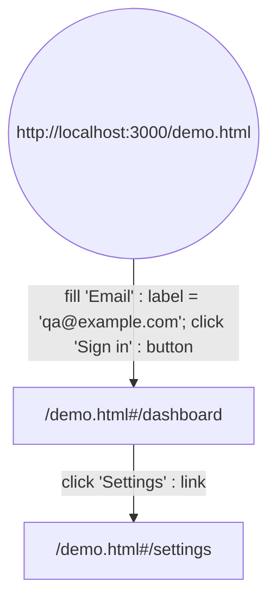
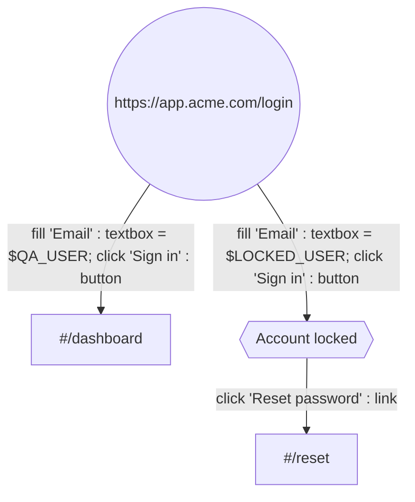
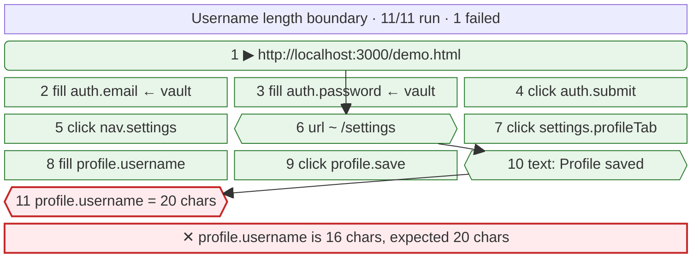

# ghostclick

A browser-automation PoC: a synthetic cursor visibly glides across a live
headless-Chrome feed and clicks things, driven by a small DSL — against any
allowlisted URL, with the script rendered as a mermaid diagram.

```bash
npm install
npx playwright install chromium   # skip if your sandbox already ships one
npm start                         # → http://localhost:3000

npm run check                     # end-to-end, against a running server
npm run check:teach               # demonstrate by hand, then replay what it wrote
npm run check:diagram             # generated mermaid vs. the real parser
```

Two bundled apps to drive. **Meridian** silently truncates a username to 16
characters while showing a success toast. **Nimbus** shows `Widget × 2` in the
cart and charges for one. Both bugs turn their run red.

---

## How it works

Three loops share one Chrome. Video flows right-to-left, control flows
left-to-right, and they meet only inside `VirtualCursor`. The IR forks: the
same data structure the executor walks is what gets drawn.

```
   LOOP 1 — video                        LOOP 2 — control

   Chrome                                viewer <textarea>
     │ Page.screencastFrame                    │ WS {t:'command', text}
     ▼                                         ▼
   node: ACK, cache lastFrame              parse.js   text → IR
     │ WS binary (JPEG)                         │
     ▼                                         ▼
   canvas.drawImage()                      validate() ← origin allowlist
                                               │        + target grammar
                                               ├──────────────┐
                                               ▼              ▼   LOOP 3 — picture
                                           executor       diagram.js
                                               │              │ IR → block-beta
                                               ▼              ▼ WS {t:'diagram'}
                                        VirtualCursor    mermaid.render()
                                          (owns x,y)
                                               │
                            ┌──────────────────┴──────────────────┐
                            ▼                                     ▼
              CDP Input.dispatchMouseEvent            WS {t:'cursor'|'press'}
                            │                                     │
                            ▼                                     ▼
                   Chrome really moves                 <svg> arrow moves
                                                       (delayed by LAG)
```

The fork at the bottom is the core design. One object owns the pointer
position; every move injects a real event into Chrome **and** emits a draw
event to the overlay in the same tick. `click()` takes no coordinates — it
fires wherever the cursor already is — so the drawn arrow and the injected
click cannot disagree about where they are.

The fork in the middle is why the diagram can't lie either: `diagram.js` is a
pure function of the same IR, run twice — once before execution as a plan, once
after with outcomes folded in as a report.

### One click, in time

```
 t=0      executor : pointAt('button:Sign in') → waitFor → boundingBox → (373,434)
 t=0..420 cursor   : ~26 × moveTo() ─┬─ CDP mouseMoved       ──▶ Chrome
                                     └─ WS {t:'cursor',x,y}  ──▶ viewer (draws at t+LAG)
 t=420    cursor   : re-read the box; correct if the page reflowed mid-glide
 t=560    cursor   : click() ─┬─ WS {t:'press'} ──▶ ripple at t+LAG
                              ├─ CDP mousePressed
                              │   └ 70ms hold — a press with no duration is
                              │     invisible on a 10fps feed
                              └─ CDP mouseReleased
 t=630+   Chrome   : repaints → screencastFrame → ack → viewer canvas
```

---

## Teach mode

Press **Record**, then click and type on the feed. Canvas input goes through the
same `VirtualCursor` the executor drives, so it reaches Chrome as genuine DOM
events — which means one injected capture-phase listener sees a human
demonstrating exactly as it would see the executor replaying. Recording is gated
off during a run so the two never feed each other.

What comes back is the script:



Two things make it trustworthy rather than merely clever.

**The page proposes; the server decides.** For each interaction the page offers
several candidate targets, most stable first — `testid:`, `label:`, `role:name`,
`placeholder:`, `text:`. Each is resolved with the same locator the executor will
use and kept only if it matches exactly one element, and that element is the one
interacted with. A recorder that emits targets it has not proved is how you get a
suite that passes on the machine that recorded it and nowhere else.

**A typed password never leaves the page.** A `type=password` field records as
`$TODO`, which fails loudly on replay until someone maps it to a vault key. The
value is dropped in the browser, so it is never in the socket, the log, or the
script.

`npm run check:teach` drives the canvas the way a human would, then replays the
result and asserts the typed password is nowhere in it.

## Any URL


`goto` reaches any origin on the allowlist:

```bash
ALLOWED_ORIGINS="https://staging.acme.com,https://app.acme.com" npm start
ALLOWED_ORIGINS="*" npm start        # public origins only; see below
```

Under `*` the private network stays off limits — `localhost`, RFC1918,
`169.254.0.0/16` (cloud metadata lives there), `.internal`, `.local`. Naming an
internal origin explicitly is an opt-in; a wildcard is not. **Known gap:** this
checks the hostname, not what it resolves to, so a public name pointing at a
private address still gets through. The real fix is resolve-and-pin, or an
egress firewall on the container.

### Targets, without a hand-written registry

An app you just typed a URL for has no page-object registry, so targets are a
small closed grammar of semantic locators:

```
button:Sign in        role shorthand   → getByRole('button', {name, exact})
textbox:Email         role shorthand
label:Username        → getByLabel
text:Profile saved    → getByText
placeholder:Search    → getByPlaceholder
testid:save-btn       → getByTestId
auth.email            an alias, which resolves to one of the above
```

Matching is **exact**: a target names one element, so `button:Add Widget` does
not also match "Add Widget Pro" and resolve to two nodes.

The viewer's **Targets on this page** panel is populated from Playwright's
`ariaSnapshot()` on every navigation — the same accessibility model
`getByRole` queries, so everything listed is guaranteed to resolve. Click a
chip to drop it into the script. That is what makes an unseen URL scriptable.

Aliases (`targets.js`) are optional per-origin sugar, and they are **data**:
their values are target strings in the grammar above, never functions, so an
alias table cannot smuggle in a selector or a callback.

---

## The security model is subtractive

There is no `evaluate` op and no raw-selector op. A target is never interpreted
as a selector — it is parsed into a fixed strategy and looked up. An automation
agent reads the app under test, which is untrusted content; injection can only
buy an attacker whatever the action space permits, and this one is five verbs
over elements that must already exist on an allowlisted page.

Dynamic URLs move part of the gate to run time, so it is now two layers:

| | checks |
|---|---|
| `validate()`, before anything runs | op vocabulary, origin allowlist, target **grammar**, plan length, no literal credentials |
| resolution, at step time | the parsed target must actually resolve on the live page |

`npm run check` asserts these stay rejected — re-run it after any change to
`ops.js` or `targets.js`:

```
click nope.nothing                              → Bad target — expected <role|label|…>:<name>
click css:#usr_nm_2                             → Unknown target strategy "css"
click button                                    → Bad target (no name)
goto "file:///etc/passwd"                       → goto needs an http(s) url
goto "http://169.254.169.254/latest/meta-data/" → origin is not allowlisted
goto "https://evil.example.com/"                → origin is not allowlisted
evaluate "fetch(1)"                             → unknown verb
```

---

## Two front ends, one IR

The line DSL and the mermaid flow language meet at `validate()`; the executor
never learns which was typed.

```
suite  "Cart total ignores quantity"
goto   "http://localhost:3000/shop.html"
fill   textbox:Search with "Widget"
click  button:Add Widget
expect text "Widget × 2"
```

The flow language is a strict subset of mermaid `flowchart`, so the script *is*
the picture — paste it in a README and GitHub draws your suite:



Node shape is the assertion; edge label is the action.

| syntax | meaning |
|---|---|
| `id(("http://…"))` | entry point → `goto` |
| `id["/settings"]` | on arrival, assert url contains `/settings` |
| `id{{"Profile saved"}}` | on arrival, assert that text is visible |
| `id("Profile tab")` | just a name, no assertion |
| `--\|click 'Sign in' : button\|--` | `click` |
| `--\|fill 'Email' : textbox = $QA_USER\|--` | `fill` from the vault |
| `--\|fill 'User' : textbox = 'a' * 20\|--` | `fill`, repeated value |
| `--\|check 'User' : textbox is 20 chars\|--` | assert value |
| `--\|wait 500ms\|--` | `wait` |
| `-->` bare | no action, just assert the destination |
| `a; b; c` in one label | three ops on one transition |

Two rules the graph needs. **Order**: depth-first from each entry, edges in
declaration order; a self-loop is the next step in the same place, and several
edges leaving one node fork into separate cases — which is how a shared login
prefix gets written once. **Strictness**: mermaid is permissive, the runner is
not. An edge label it cannot read is a hard error, never a silently skipped
step, or a typo becomes a no-op that quietly passes.

Those `'single quotes'` and `'a' * 20` are not stylistic. Verified against the
real parser: double quotes, parentheses and square brackets inside `|...|` are
all lexical errors.

## The run report

`diagram.js` turns the same IR into `block-beta`. Actions become grid cells,
`goto` a full-width band, assertions hexagons on the arrow spine — and a
credential shows as `← vault`, since the value was never in the IR, so the
diagram is safe to paste into a ticket.



`npm run check:diagram` renders every generated diagram with the real mermaid
parser. Generated mermaid that doesn't parse is worse than none — it fails
silently inside someone else's docs.

---

## Files

| File | Role |
|---|---|
| `server.js` | express + ws, CDP screencast pump, executor loop |
| `cursor.js` | `VirtualCursor` — sole authority for pointer position |
| `targets.js` | target grammar, aliases, page discovery |
| `recorder.js` | teach mode — proposes targets in the page, verifies them here |
| `flow.js` | mermaid flow language: text ↔ IR, both directions |
| `ops.js` | op vocabulary, origin allowlist, validation gate |
| `parse.js` | DSL text → JSON IR |
| `diagram.js` | JSON IR → mermaid `block-beta` |
| `public/index.html` | canvas feed, cursor overlay, editor, targets, diagram |
| `public/demo.html` | Meridian — truncates a username to 16 chars |
| `public/shop.html` | Nimbus — cart total ignores quantity |
| `scripts/check.js` | end-to-end: rejections, discovery, all three runs |
| `scripts/check-teach.js` | demonstrate by hand, replay what it wrote |
| `scripts/check-diagram.js` | generated mermaid vs. the real parser |

---

## Seven things that will bite you

**Ack every frame, first thing.** `Page.screencastFrameAck` is Chrome's
backpressure valve. Skip it and you get exactly one frame and then silence,
which presents as a broken WebSocket and is not.

**Delay the overlay to match the video.** Frames land ~120ms behind reality;
cursor events land in ~10ms. Without `LAG` the arrow clicks before the frame
showing the click, and the whole thing reads as glitching rather than as an
agent working.

**Frames are damage-driven, not a fixed framerate.** A static page emits
nothing, so a viewer connecting to an idle session sees a blank canvas —
`server.js` caches `lastFrame` and primes new clients. (`0 fps` on a settled
page is this, not a stall.)

**Clear the run lock before announcing the run ended.** `run.end` means "you
may start another run". Emitting it while still locked makes a caller that runs
back-to-back scripts hang on a silently refused second run.

**A recorder's verification races the app's own reaction.** Submitting a form
hides the form; a button behind `display:none` stays in the DOM but leaves the
accessibility tree, so the role query that would have named it returns nothing.
Any check that runs after the click is checking a page that no longer exists.
`recorder.js` therefore counts matches synchronously in the page at event time
and uses that when the live check comes back empty.

**`pushState` fires neither `popstate` nor `hashchange`.** An SPA route change
has nothing to announce it, so a recording loses its last navigation unless you
read the URL when the recording stops. Related: watching `framenavigated` to
record URLs raced the bindings and filed clicks *after* the transitions they
caused — everything now arrives through one ordered channel from the page.

**block-beta sizes cells roughly square, so label length drives the diagram's
height.** A 24-character budget produced 550×478 for eleven steps; leaving the
labels long produced 983×1192 for the same steps. Nested `block:…end` groups
are worse — they stretch their rows to ~2500px. `diagram.js` uses one flat grid
with full-width bands, and hexagons get a smaller budget than rectangles
because their angled sides eat usable width.

---

## Deliberately not here yet

- Screenshot artifacts, and shipping them to S3 rather than over the socket
- Pause/resume gate in the executor loop
- Recording `select`, drag, hover and keyboard-only navigation
- Merging a new recording into an existing flow rather than replacing it
- `theatrical` / `normal` / `fast` modes — glide and typing delays turn a
  4-second test into ~25 seconds, right for demos and wrong for CI
- Timestamp-based overlay sync instead of a fixed `LAG` constant
- Auth on the WebSocket; one container per session; egress firewall
- `Target.attachedToTarget`, so a popup doesn't freeze the feed on the old page
- Discovery refresh on DOM mutation, not just on navigation — the panel goes
  stale when a click reveals new controls without navigating
