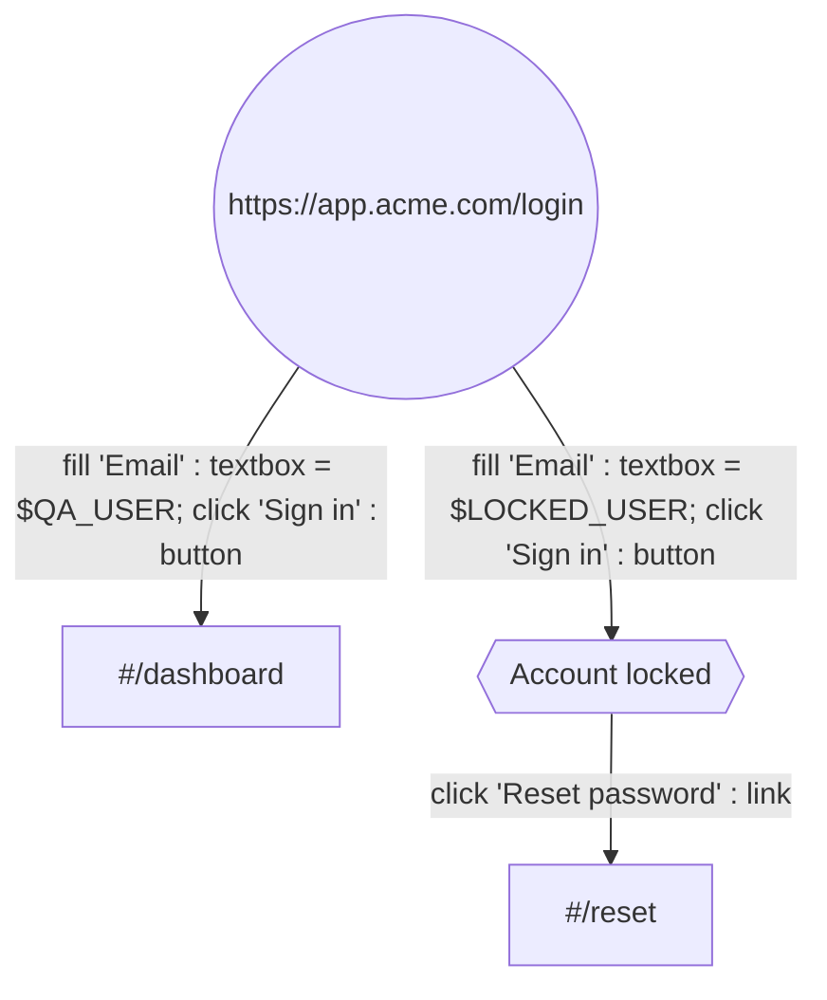
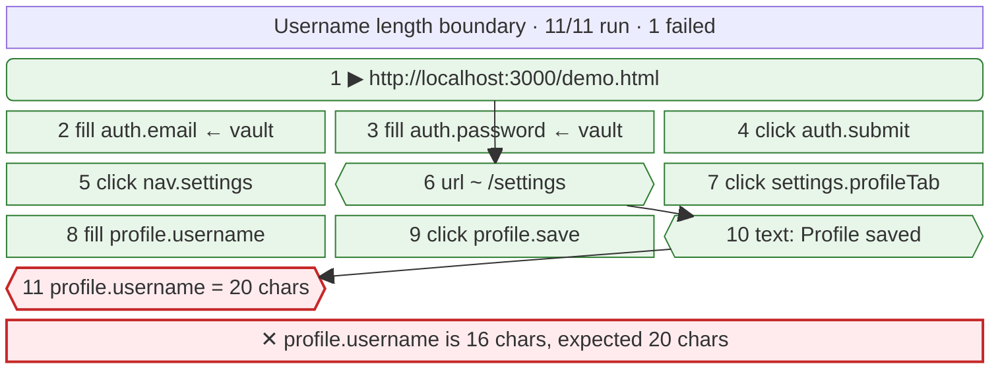

# ghostclick

A browser-automation PoC: a synthetic cursor visibly glides across a live
headless-Chrome feed and clicks things, driven by a small DSL — against any
allowlisted URL, with the script rendered as a mermaid diagram.

**New here? [SETUP.md](SETUP.md) walks through it end to end** — server, your
own app, credentials, the extension, and a first recording.

```bash
npm install
npx playwright install chromium   # skip if your sandbox already ships one
npm start                         # builds the UI if it changed, then serves it

npm run check                     # end-to-end, against a running server
npm run check:freshness           # the UI rebuilds, and nothing serves a stale one
npm run check:runner              # a command is never dropped, the lock always clears
npm run check:suites              # onboarding, the origin gate, suite runs
npm run check:recording           # repeated links, scrolling, jump-to-top, timeouts
npm run check:longnames           # paragraph-long names, casing, sticky anchors
npm run check:naming              # when the page and the browser disagree about an element
npm run check:redirects           # redirect chains, statuses, the friendly 404
npm run check:app                 # one command starts it all, with one shared key
npm run check:patience            # late vs never coming, and settling
npm run check:pace                # a fast run reaches the same verdict as a watched one
npm run check:console             # the canvas paints, and the wheel reaches the page
npm run check:teach               # demonstrate by hand, then replay what it wrote
npm run check:fidelity            # does the replay reproduce it? would coordinates have?
npm run check:shared              # the picker, the hand-off, every copy of the language
npm run check:auth                # forgeries refused, Python signs it, Node checks it
npm run check:boundary            # the three projects can still be split apart
npm run check:diagram             # generated mermaid vs. the real parser
```

The UI is a Vue 3 app in `web/`, built to `web/dist/`. That build is committed,
so the app runs with no bundler present — but `npm start` also **rebuilds it
when a source file is newer than the build**, so one command always gives you
the latest. A start with nothing to do says `up to date` and costs nothing.

```bash
npm run app                       # everything, from a fresh clone ← the one you want
npm run app -- --auth             # and the Django control plane, with sign-in
npm run app -- --fast             # runs skip the performance
npm start                         # just the runner, if setup is already done
npm run serve                     # run only, never build
npm run dev                       # Vite in front of it, on :5173
npm run build                     # → web/dist/, commit the result
npm run check:all                 # every check, in one command
```

## Three projects, one repository

`web/` (the UI) and `auth/` (the control plane) are **separate projects** that
happen to live here. Neither reads a file outside itself, the server is
*pointed* at a built UI directory (`GC_WEB_DIR`) rather than owning the path,
and the control plane is reached over HTTP and joined to the runner by one
signed token. That is what makes splitting them into their own repositories a
`git mv`; `npm run check:boundary` is what stops it quietly ceasing to be true.
See [docs/BOUNDARY.md](docs/BOUNDARY.md).

## Signing in, when you want to

There is no login by default, and that is the intended shape for one person on
one laptop. Set `GC_AUTH_SECRET` and every `/api` route and the WebSocket
require a short-lived token minted by the Django control plane in `auth/`; the
boot banner says which mode it is in every time.

```bash
GC_AUTH_SECRET=$(node -e "console.log(require('crypto').randomBytes(48).toString('base64url'))")

# the control plane                          # the runner              # the UI
cd auth && python manage.py runserver 8000   GC_AUTH_SECRET=… npm start   VITE_AUTH_URL=http://localhost:8000 npm run build
```

The origin allowlist and the vault stay entirely on the runner and are
re-checked there, so the control plane can neither add an origin nor read a
secret. Passwords are Argon2id-hashed, at least 15 characters, and checked
against Have I Been Pwned; every sign-in, sign-out and refused password is a
row in an audit log; a session ends after 12 idle hours or 7 days, whichever
comes first. See [auth/README.md](auth/README.md), and
[docs/AUTH.md](docs/AUTH.md) for where this is going.

Deployed, the same three services sit behind one Caddy on one URL
(`PUBLIC_URL`), from which every host, origin and cookie rule is derived, with
the runner on a network that has no route to the control plane or its stores.
See [docs/DEPLOY.md](docs/DEPLOY.md).

It prints what it is running, and the sidebar shows the same thing:

```
  ui          ->  rebuilt (built in 880ms)
  version     ->  0b8c46a, ui built 2026-09-06 16:43
```

If that commit is not the one you expect, you are looking at an old UI — which
is worth knowing before spending an afternoon on a bug you already fixed.

The console starts empty on a first run — the runner opens whatever you ran
last, and a fresh clone has no history yet. Paste a URL, or run one of the
suites below.

Two bundled apps to drive. **Meridian** silently truncates a username to 16
characters while showing a success toast. **Nimbus** shows `Widget × 2` in the
cart and charges for one. Both bugs turn their run red.

---

## How it works

The whole pipeline, editable: [`docs/ghostclick-end-to-end.drawio`](docs/ghostclick-end-to-end.drawio)
— open it at [app.diagrams.net](https://app.diagrams.net) or with the draw.io
VS Code extension.


Three loops share one Chrome. Video flows right-to-left, control flows
left-to-right, and they meet only inside `VirtualCursor`. The IR forks: the
same data structure the executor walks is what gets drawn.

```
   LOOP 1 — video                        LOOP 2 — control

   Chrome                                viewer <textarea>
     │ Page.screencastFrame                    │ WS {t:'command', text}
     ▼                                         ▼
   node: ACK, cache lastFrame              parse.js   text → IR
     │ WS binary (JPEG)                         │
     ▼                                         ▼
   canvas.drawImage()                      validate() ← origin allowlist
                                               │        + target grammar
                                               ├──────────────┐
                                               ▼              ▼   LOOP 3 — picture
                                           executor       diagram.js
                                               │              │ IR → block-beta
                                               ▼              ▼ WS {t:'diagram'}
                                        VirtualCursor    mermaid.render()
                                          (owns x,y)
                                               │
                            ┌──────────────────┴──────────────────┐
                            ▼                                     ▼
              CDP Input.dispatchMouseEvent            WS {t:'cursor'|'press'}
                            │                                     │
                            ▼                                     ▼
                   Chrome really moves                 <svg> arrow moves
                                                       (delayed by LAG)
```

The fork at the bottom is the core design. One object owns the pointer
position; every move injects a real event into Chrome **and** emits a draw
event to the overlay in the same tick. `click()` takes no coordinates — it
fires wherever the cursor already is — so the drawn arrow and the injected
click cannot disagree about where they are.

The fork in the middle is why the diagram can't lie either: `diagram.js` is a
pure function of the same IR, run twice — once before execution as a plan, once
after with outcomes folded in as a report.

### One click, in time

```
 t=0      executor : pointAt('button:Sign in') → waitFor → boundingBox → (373,434)
 t=0..420 cursor   : ~26 × moveTo() ─┬─ CDP mouseMoved       ──▶ Chrome
                                     └─ WS {t:'cursor',x,y}  ──▶ viewer (draws at t+LAG)
 t=420    cursor   : re-read the box; correct if the page reflowed mid-glide
 t=560    cursor   : click() ─┬─ WS {t:'press'} ──▶ ripple at t+LAG
                              ├─ CDP mousePressed
                              │   └ 70ms hold — a press with no duration is
                              │     invisible on a 10fps feed
                              └─ CDP mouseReleased
 t=630+   Chrome   : repaints → screencastFrame → ack → viewer canvas
```

---

## Where the script actually runs

This is the thing that trips everyone up once, so: **Run script does not touch
your mouse, or your tabs, or the page you are reading.**

It drives a *separate* browser that ghostclick launched, and streams a video of
that browser onto the canvas. The arrow gliding across the canvas is drawn over
that video. Your own cursor never moves, because it is not involved.

```
your screen                          the browser being driven
┌──────────────────────────────┐     ┌─────────────────────────┐
│ the viewer, in your browser   │     │  a second browser,       │
│                               │     │  launched by the server  │
│   canvas  ◀── video ──────────┼─────┤                          │
│   arrow   ◀── coordinates ────┼─────┤  ← the clicks land here  │
│                               │     │                          │
│   your real mouse: untouched  │     └─────────────────────────┘
└──────────────────────────────┘
```

That separation is the point. It means a run behaves the same on your laptop, on
a server, and in CI, and it means you can keep working while a suite runs.

**If nothing appears to happen when you press Run**, look at the canvas, not at
your own page. The status bar under it says what is going on, and says why if a
run failed.

### Watching it in a real window

If a video of a browser is not convincing, open a real one:

```bash
HEADED=1 npm start
```

A Chrome window appears and gets driven in front of you — same automation, same
canvas feed, just visible in a browser you recognise. Worth doing once. Leave it
off for anything unattended, since a headless browser is what makes a run work
on a server with no screen.

The banner says which mode you are in:

```
  browser     ->  headed — a real window you can watch
```

### What it deliberately will not do

It will not take over your operating system's cursor. That is a different kind
of tool — it would fight you for the machine, break the moment you moved the
mouse, and could not run anywhere without a screen. Everything here works
through the browser rather than around it.

## Test suites — how a project gets in

### The fast way: one URL

Paste your app's URL on the Test suites screen and press **Add and test**. It
opens the page, names the suite from its title, reads what is on it, asserts you
reached it, and runs that — so you find out whether the runner can drive your app
at all before deciding how much to invest.

It asserts only the URL. Guessing which of a page's words are stable enough to
assert would produce a suite that fails for reasons nobody chose, so the text
expectations stay a human decision, one screen away.

The gate is not skipped: a URL nobody has approved comes back naming the origin
it needs, and the same panel becomes the button that approves it.

Scanning also reads the same-origin links on the page, so the app's own nav
becomes a row of one-click **+ Billing `/#/billing`** buttons. Onboarding a real
multi-page app is clicking its navigation, not typing its routes.

### The thorough way: four questions

A suite is the onboarding unit. Not a folder of scripts: the answer to four
questions, asked in the order that makes each one answerable.

| Step | What you give it | What it buys you |
|---|---|---|
| **Project** | a name and one base URL | the origin is decided once, in front of a person |
| **Pages** | the discrete URLs worth visiting | a **scan** opens each in the runner and reads its accessibility tree |
| **Expectations** | ticks over what the scan found | assertions that survive a markup change, because they came from the same model `getByRole` queries |
| **Cases** | recorded or written flows | the suite runs |

A suite covers **one origin**, and every page is a path beneath it. That is not
tidiness — it means adding a page later can never walk the runner to a host
nobody approved. The origin decision happens once and the suite cannot widen it
afterwards.

Creating a suite does **not** allow its origin. Onboarding asks for that
separately, with a button, because allowing an origin is a human act and always
has been. A generated plan cannot reach it; neither can the wizard.

Nothing unrunnable is ever stored. Every case is parsed and validated on the way
in with the same function the executor uses, so a case that cannot run is
refused at save rather than discovered at 2am:

```
POST /api/suites/x/cases  {"flow": "testcase TD\n a((\"https://evil.example.com/\"))"}
→ 400  Step 0: origin https://evil.example.com is not allowed yet
```

The payoff of onboarding is that the suite tests something before anyone records
a click. Each page's expectations generate a case — reach it, assert what should
be there — and that is the test that catches "the URL moved" instead of leaving
it as a mystery three steps into a longer flow.

Suites live in `suites/*.json`, **in the repository**, one readable file each.
Run history is machine-local (`.ghostclick/`, gitignored) because it records what
happened on your machine; a suite is the opposite — the shared description of a
project, so it should diff, review and merge like any other source file.

---

## Teach mode

Press **Record**, then click and type on the feed. Canvas input goes through the
same `VirtualCursor` the executor drives, so it reaches Chrome as genuine DOM
events — which means one injected capture-phase listener sees a human
demonstrating exactly as it would see the executor replaying. Recording is gated
off during a run so the two never feed each other.

What comes back is the script:

```
%% suite "Recorded flow"
testcase TD
  n0(("http://localhost:3000/demo.html"))
  n1["/demo.html#/dashboard"]
  n2["/demo.html#/settings"]

  n0 -->|fill 'Email' : label = 'qa@example.com'; click 'Sign in' : button| n1
  n1 -->|click 'Settings' : link| n2
```

Two things make it trustworthy rather than merely clever.

**The page proposes; the server decides.** For each interaction the page offers
several candidate targets, most stable first — `testid:`, `label:`, `role:name`,
`placeholder:`, `text:`. Each is resolved with the same locator the executor will
use and kept only if it matches exactly one element, and that element is the one
interacted with. A recorder that emits targets it has not proved is how you get a
suite that passes on the machine that recorded it and nowhere else.

**A typed password never leaves the page.** A `type=password` field records as
`$TODO`, which fails loudly on replay until someone maps it to a vault key. The
value is dropped in the browser, so it is never in the socket, the log, or the
script.

`npm run check:teach` drives the canvas the way a human would, then replays the
result and asserts the typed password is nowhere in it.

## Recording somewhere you can't reach

Teach mode only records apps ghostclick's own browser can open. An app behind
SSO, a VPN, or a real login is a wall — your Chrome is already through it. So
`extension/` is a Chrome extension that records there instead.

Load it from `chrome://extensions` (Developer mode → Load unpacked), open the
app, and click the toolbar icon. Then:

```
Pick element   →  the next click is HELD, not delivered
panel asks     →  Click it / Type into it / Assert text visible
you answer     →  the step is written, and the click is replayed for real
```

Pick, annotate, then perform — in that order. Arm the picker, click a sidebar
link without suppressing it, and the page navigates away while the panel is
still asking about a button that no longer exists.

**Send to ghostclick** posts the flow to `/api/recording`, which validates it
through the same gate as everything else and drops it in the script box. It is
never run automatically: any page you visit can reach a localhost port, so an
endpoint that executed what it was handed would be a remote-code path with
extra steps.

`extension/lib/propose.js` — how an element gets named — is read off disk and
injected by the server's teach mode as well, so the extension and the runner
cannot disagree about what a target means. `npm run check:shared` asserts
that, drives the picker against a real page, and loads the extension in Chrome.

See `extension/README.md` for the rest, including why replaying a login needs
either the login recorded or a session you have chosen to export.

## “Why doesn’t it just replay my coordinates?”

It records them — every click carries where the pointer actually was, and the
box it landed in, as `%% at` comments that round-trip through the language. It
just doesn’t *navigate* by them.

`npm run check:fidelity` settles both halves of this by running them:

```
— 1 · demonstrate by hand, then replay what it wrote
  demonstrated  http://localhost:3000/demo.html#/settings
  replayed      http://localhost:3000/demo.html#/settings
  same page after both  ✓
  no drift — every element resolved where it was clicked

— 2 · would replaying the coordinates have worked?
  same page, window 880 wide instead of 1180:
    coordinate 353,371 now lands on   div#login  (the Sign in button? NO)
    button:Sign in still resolves                yes, exactly one
```

Part 1 demonstrates a login by hand, replays the recording from a clean start,
and compares the two end states — same URL, same accessible tree. Part 2 takes
the recorded coordinate for the Sign in button and asks what is there in a
narrower window. Nothing useful: the layout is centred, so the point that was
the button is now the `<div>` behind it. The name still finds it.

That is the whole reason record-and-replay tools built on coordinates have the
reputation they do. A window a hundred pixels narrower, a scrollbar, a cookie
banner, a different DPI, one extra row in a table — any of those moves the pixel
without moving the button.

So the coordinates are kept as **evidence**, not as the mechanism. On replay
each one is compared with where the element actually resolved, and a step that
lands somewhere else says so:

```
button:Sign in: recorded at 353,371 but resolves to 812,540 — 471px away.
Fine if the layout moved; suspicious if it did not.
```

That is the case coordinates genuinely catch and a name cannot: a target that
resolves cleanly to exactly one element — the wrong one.

### “Live — run failed”, with no reason

Two things used to make that unhelpful, and both are fixed.

The status bar now carries the first line of whatever broke, and the full text
is in its tooltip and the run log.

And the most common failure now names itself. If you press **Record** while
already deep in the app — logged in, three screens down — the recording's entry
URL is wherever you happened to be. In a single-page app the path is usually
decorative: pushed with `history.pushState`, never read on load. So replaying
`/app#/settings` hands the runner the **login screen**, and the first step waits
eight seconds for a field that was never going to appear.

Recording now fingerprints what the entry page offered, and replay checks it
before doing anything else:

```
✕ step 0 — This recording starts part-way through a session.
  http://localhost:3000/demo.html#/settings loads a different page than the one
  it was recorded on — 1 of 4 expected elements are here.
    expected: link:Settings, button:General, button:Profile, textbox:Time zone
    found:    link:Settings, textbox:Email, textbox:Password, button:Sign in
  Record again from a URL that reaches this screen on its own — usually the
  login — so the flow can get itself back here.
```

**Start recording from a URL that stands on its own.** Usually the login page.
Record the sign-in as part of the flow; that is what makes it repeatable on a
machine that has never seen your session.

### A menu that is only there while you point at it

The most common way a recording of a real site fails. A dropdown's items do not
exist in the page until the pointer is on whatever opens them, so a script that
only clicks waits eight seconds for a menu nobody opened:

```
✕ click menuitem:Catch harmful AI answers …
  locator.waitFor: Timeout 8000ms exceeded
```

Three things now deal with it.

**The recorder notices.** It keeps a baseline of what is on the page when the
pointer is *not* provoking anything, and a short trail of what the pointer has
been over. A click on something that was not in the baseline was revealed by the
pointer, so the last thing it was over that *was* already there gets recorded as
a `hover` first — without anyone having to know to add it:

```
n0 -->|hover 'Use Cases' : link; click 'Catch harmful answers …' : menuitem| n1
```

The baseline is only refreshed while nothing is hovered. Sampling on a plain
timer was wrong: pause on an open menu for longer than the interval and the open
menu becomes the baseline, so the click that follows looks like it was always
available.

**The cursor approaches instead of lunging.** It used to glide straight from the
trigger to the item, which cuts the corner and leaves the region keeping the menu
open — the menu shut mid-glide and the runner waited for an element that had
stopped existing. It now enters the target's box at the point nearest the cursor
and then settles to the aim point: two short legs that stay inside.

**And `hover` is an op you can write by hand**, in the flow language and in the
extension's picker (**Hover it**), for the cases nothing infers.

**When a target still cannot be found**, the failure names what the page does
have, which is usually the answer:

```
"menuitem:Catch harmful answers …" never became visible.
  The page does have: link:Catch harmful AI answers.
  If yours lives in a menu, put a hover step before it:
    home -->|hover 'Use Cases' : link; click '…' : menuitem| home
```

Often the plain `link:` version is the better target anyway — it does not depend
on a menu being open.

### What a recording still does not capture

Being straight about the edges, because this is where “it didn’t run what I did”
turns out to be true:

- **Scroll position.** Steps scroll their own element into view; a scroll you did
  for its own sake is not a step.
- **Drag, and anything mid-gesture.**
- **Keyboard-only navigation** — tabbing to a control and pressing Enter records
  as nothing, because no element was clicked.
- **Where inside an element you clicked.** Replay aims at the centre. It matters
  for a canvas, a map, or a slider; nowhere else.
- **Your timing.** Waits are re-derived from what the page does, not from how
  long you took.

Each of those is a real gap, not a subtlety. If your flow needs one, say so and
it becomes an op.

## The runner starts where you left off

It used to start on `demo.html`, the bundled demo app, every time. That is a
reasonable thing to see once and a strange thing to be shown on the fortieth
launch, when what you were actually working on was a staging URL.

It starts on the last site you ran now, read out of run history — `HOME_URL`
still wins if you set one, and if there is neither it opens nothing and the
console says "Nothing open yet" instead of showing a black rectangle and the
word "waiting", which reads as a hang.

The remembered URL still has to pass the origin gate. It is a URL that ran here
before, so it normally does — but an origin you have since removed should not be
re-opened just because a file remembers it. Verified by running against a second
origin, revoking it, and restarting: the boot skipped that newest entry and fell
back to the one before it.

The URL box no longer suggests `demo.html` either, and it has an accessible name
now — the checks were finding it by its placeholder text, which is a fragile way
to find a control and left it unlabelled for anyone using a screen reader.

The rule lives in `home.js` and is pure — no fs, no network, no browser —
because the version inside `server.js` could not be tested without starting a
browser and binding a port, and the branch that mattered most was therefore
never executed anywhere. Run history is gitignored, so **every machine that had
ever run the suite took the first branch and no machine ever took the last
one**: on a fresh clone or a CI runner the browser stays on `about:blank`, and
three things broke there that the green suite could not see.

`check:startup` covers the decision against fabricated input — including the
empty-history case this machine cannot produce — and then starts a real server
on its own port and reads its boot banner, which prints the choice before
navigating. Both halves are needed: the first alone would pass while
`server.js` ignored the function entirely, and the second alone can only test
whatever state the machine happens to be in. It drives one case against a
different page first, so the rule's answer can never coincide with the demo
that a reverted server would open.

What a null home broke, now fixed: `check-console`'s first two sections
asserted on a painted canvas before opening anything, so they were testing
yesterday's history rather than the product; `entryUrl()` returned the string
`'about:blank'`, which is truthy, so pressing Record before opening anything
produced a case whose step 0 was `goto "about:blank"` — refused by the origin
gate forever, unsaveable and unrunnable; and the URL box pre-filled with it, so
Open answered `Only http and https can be driven, not about:`.

`about:blank` also *paints* — a blank white frame is still a frame — so the
"Nothing open yet" state has to be checked before `painted`, or it never
appears and you get an unexplained white rectangle instead of the black one it
replaced.

## Defects, read out of run history

Run history answers "what happened". Defects answers "what is broken", which is
a different question and was not being asked anywhere.

A run records only its first failure, because a run stops there — so a defect is
that sentence, and the useful questions about it are how often it has happened,
which cases it takes down, and whether it is still happening. Grouping by the
message rather than by the case is the point: one broken selector usually breaks
four cases, and four rows saying the same thing is a list, not a diagnosis.

Nothing here is hand-managed and there is no state to keep in sync. A defect is
**open** when no affected case has passed since it last failed, so it closes
itself when the thing is fixed — a tracker nobody has to remember to update is
the only kind that stays true.

## Hero images

Drop `.jpg`, `.png`, `.webp` or `.avif` files into `public/hero/` and the hero
panels use them as a backdrop. An empty folder is the normal case and you get
the gradient. The list is read per request, so adding files needs a reload and
not a restart.

Each page picks one deterministically from the sorted list, so a page keeps the
same picture across reloads and two pages do not show the same one — a hero that
reshuffles on every navigation reads as a page that has not finished loading.

**The scrim is not decoration.** Putting arbitrary photographs behind near-black
text is how a page becomes unreadable on the one image nobody checked, so the
text sits on a band of solid panel colour that fades into the picture and even
the far edge keeps 45% panel over it. Legibility does not depend on which image
you chose, which matters when the folder is filled by whoever is using the tool
rather than by a designer.

## The console of the page you are driving

A step fails with `expected the URL to contain "/dashboard"`, and the reason is
usually something the page already printed — an uncaught TypeError, a 500 its
fetch wrapper logged. That reason lived inside a browser nobody could open
devtools on.

Everything the driven page prints is forwarded now: every `console.*` level,
plus `pageerror`, which never reaches `console.*` and is the one you most often
want. It sits under the script, folded away behind a toggle with an error count
on the header, because an app that logs on every render would otherwise be the
whole screen. Consecutive duplicates fold to one line with a count, the same as
the run log.

**Vault values are redacted on the way out.** A fetch wrapper printing the token
it just sent is not a rare mistake, and a secret that never leaves the server
must not leave it through here either — so a match on any vault value is
replaced with its name:

```
auth: sending token $QA_PASS to /api/session
```

`public/noisy.html` is a page shaped like an app mid-incident — every level, one
line repeated five times the way a render loop repeats it, the bundled demo
credential printed the way a hurried wrapper prints it, then a throw.
`check:console` section 7 drives it. Removing the redaction turns that check red
with `THE SECRET IS ON SCREEN`.

The ↑ Top / ↓ Bottom buttons are gone. The wheel is the way you scroll a page,
and the buttons were a workaround from before it worked. The `scroll to top` and
`scroll to bottom` verbs in the language are untouched — a script still needs to
say "go to the footer" — but the socket op the buttons used went with them
rather than being left unreachable.

## Summarised, not tipped out

The console's right rail had two cards that dumped rather than reported.

**"On this page"** listed every target flat. On a real marketing page that is
thirty-odd links, two buttons and a search box — and the three things you would
actually drive are buried in the middle of the thirty. It groups by role now,
the things you type into and press before the links, six per group with the
rest a click away, and a chip is capped so a link whose accessible name is a
178-character card title truncates instead of taking the whole row. The full
target is still on the hover title, because that is what gets inserted.

**The log** sat below all of that, which is precisely backwards: it is where
anything that went wrong says so, and it should not be underneath a list of
everything that did not. It is first in the rail now.

Both it and **"Where it went"** fold consecutive identical entries into one line
with a `×5`. A step that retried five times said the same sentence five times,
which is five times harder to read than the one line it deserved — and pushed
the thing that actually broke off the top of the box.

## A version stamp that was confidently wrong

The sidebar shows the commit and when the UI was built, so "am I on the latest?"
is answerable by looking. Both were read once, at boot.

The commit is fine that way. The build time is not: express serves the built UI
directory straight off disk, so a `vite build` in another terminal changes what the
browser gets without this process noticing. The stamp then reports a UI older
than the one it is actually serving — and a version stamp that is confidently
wrong is worse than no stamp at all, because its entire job is to be trusted at
a glance.

The commit and the start time stay fixed for the process; the build time is
`stat`ed per request. `check:freshness` already asserted the build is not older
than its source and caught this the moment a rebuild happened mid-session.

## A recording that began with a redirect

You type `strix.ai/enterprise`. The site 307s to `https://www.strix.ai/enterprise`
— different host, different scheme, a **different origin**, and one nobody
allowed. The browser follows it quite legitimately and everything looks fine.

The recording used to say it began where the redirect *landed*. That made it
unstorable: a case is validated on the way in with the same gate the executor
uses, so step 0 was refused as an origin that is not allowed, and the case was
never written. Which is how it was reported — **"why does my saved recording not
appear under saved cases?"** It was never saved. The refusal was real, and it was
rendering at the bottom of a long scrolling page, well below the button that
caused it, so pressing Save looked exactly like pressing a dead button.

Two symptoms, one cause, and the fix is the obvious one once you see it: record
the URL you **asked for**, so replaying re-does the redirect rather than needing
permission for wherever it ends up.

```js
function entryUrl(page) {
  const here = page.url();
  const n = nav.summary();
  const asked = n.hops[0]?.url;
  return n.redirects > 0 && n.url === here && asked ? asked : here;
}
```

The `n.url === here` guard matters. An SPA route change pushes a new URL without
navigating, so the last chain belongs to the document load *before* it — taking
`hops[0]` there would quietly drop the route you are standing on.

`navlog` had been computing `leftOrigin` for exactly this case, with a comment
saying it "is how you end up with a recording whose entry URL was never allowed."
The diagnosis was already written down. Nothing acted on it.

The warning you get is now accurate about what will happen, rather than
threatening a failure that no longer occurs — and it is a warning, in amber,
not an error in red:

> `http://acme.com/x` redirected to `https://www.acme.com`, which is not allowed.
> A recording made here starts from the URL you asked for, so it replays the
> redirect — allow `https://www.acme.com` only if you want to point at it directly.

**And a refusal now appears beside the button that caused it.** `check:console`
section 6 covers both: it records through a real cross-origin redirect
(`/go/offsite`), asserts the entry is the URL asked for, that the case is really
in `/api/cases` and in the picker, and — by deleting the suite behind the UI's
back — that a genuine refusal is rendered in the card rather than off-screen.
Reverting the entry fix turns four of those red; reverting the message placement
turns the fifth red on its own.

## example.com is not www.example.com

You allow `strix.ai`. The site redirects to `https://www.strix.ai`. Different
host, often a different scheme too — so that is a **different origin**, and the
browser follows the redirect quite legitimately while everything looks fine.
Then every flow you record there refuses to replay, because its entry URL names
an origin nobody approved:

```
Step 0: origin https://www.strix.ai is not allowed yet
```

`goto` now compares where it landed against where it was sent, and says so at
the moment it happens rather than three steps into a run tomorrow. It does not
auto-allow: following a redirect is the browser's business, trusting where it
ends up is a person's — so you get the button, with the reason.

The same button appears whenever a script is blocked on an origin. The failure
used to be a sentence in the log telling you to visit a panel that no longer
exists under that name; the origin travels on the error now, so the UI can
offer the one action that unblocks it.

---

## The sidebar is not a navy slab

It was, and a dark rail is a decade-old convention that puts the heaviest block
of colour on the part of the screen carrying the least information. On a tool
whose whole point is watching a browser being driven, the loudest thing on the
page should not be the table of contents.

It is white now, separated by a hairline, with one magenta accent that marks
only what is selected — the open suite, the section you are in, the one button
you are meant to press. Section labels, line icons at 16px drawn inline rather
than pulled from a 40kB font, a tinted pill for the current item.

Two magentas, because one cannot do both jobs: `brand` (#e6007c) is the fill,
which white text clears 4.5:1 on, and `brand-2` (#c2006a) is the same hue dark
enough to be 13px text on white at 6.0:1. Reaching for the bright one as small
text is the usual way an accent ends up illegible.

Three things the repaint fixed rather than caused:

**A disabled button was unreadable.** Every primary action carried
`disabled:opacity-40`, which was survivable on near-black and is not on
magenta — white on 40%-opacity pink. Disabled controls are exempt from the
contrast rules and should still be legible; they now go neutral grey instead of
transparent.

**The selected section came out grey.** The sub-nav used `active-class` to swap
`text-ink-3` for `text-brand-2`, and both are plain text utilities, so which one
won was decided by stylesheet order rather than by the order they were written.
It is bound by route name now.

**The onboarding stepper could not tell you where you were:** the current step
and a finished step were both `bg-ink text-white`, character for character.
Current is the accent, done is ink.

The pass/fail chart pair is deliberately unchanged — grey and red separate by
ΔE 9.4 under deuteranopia and that was measured, not guessed. Repainting the
chrome is no reason to re-roll it.

## Buttons that admit they are working

Half the actions here take seconds — a suite run drives a real browser — and a
button that looks identical while it works is indistinguishable from one that
is broken. **Run suite** was the worst of them: it awaited the whole run with no
busy state at all, so the only honest reading of the screen was that the click
had not registered. It counts the cases off now (`Running 2 of 4…`), with a
spinner, disabled so a second press cannot queue a second run. Every button in
the app also scales slightly on press, which is one CSS rule and the difference
between "working" and "dead".

## Run takes you to the run

A run drives a real browser for tens of seconds. **Run suite** used to start one
and leave you on the summary page, so everything worth watching — the canvas, the
steps ticking off, the log — happened on a screen you were not on. A progress bar
with the bar taken out.

Both buttons go to the console first now, and start the run there. The order
matters: `router.push` is awaited and a tick is allowed to pass *before*
`api.runSuite`, because the console has to be mounted and listening before the
first step reports. Start the run first and you arrive halfway through, to an
empty step list and a run that has already scrolled past.

The query carries the suite and deliberately **no `url`**. The run's own first
step navigates; pointing the console at a page at the same moment would have the
two fighting over one browser.

A failure now speaks in the console rather than as a sentence on a page you have
left — including the origin gate, which is a decision rather than an error, so it
arrives as the button that unblocks it.

`check-console.js` presses Run on a suite and asserts both halves: that the URL
became `/app/console`, and that the step list on it is really filling. Drop the
`router.push` and it goes red on the suite's own URL, with `(no run panel)`.

## A suite page showing another suite's runs

Suite **te** had one case and had never been run. Its page said *4 runs this
week*, and listed four passing runs — every one of them belonging to a different
suite.

Vue reuses a route component when only the parameter changes, so moving from one
suite to another never re-ran `onMounted`; the fetch that filled *Latest runs*
had fired once, for whichever suite you happened to open first, and the numbers
sat there under every subsequent name. Reload the page and it was right, which is
the worst kind of wrong — it looks like a fluke.

Overview and Runs watch the suite id now, `immediate` so the mount case is the
same code path, and they reload again when a run finishes so the numbers settle
without a refresh. The check switches between two suites *without a reload* — the
case that was broken — and the virgin one has to say `Nothing has run yet`.

## Scrolling with the wheel

Point at the canvas and use your wheel or trackpad. It is the primary way; the
↑ Top / ↓ Bottom buttons are for a page too long to roll through.

Wheel events are coalesced into **one socket message per animation frame**. A
trackpad emits well over a hundred a second, and the first version sent two
messages for every one — several hundred CDP dispatches for a single flick,
which scrolled, but in lurches. A 90-event burst is now one message carrying the
full distance.

Top and Bottom ask for a *position*. They used to send a wheel delta of ±100000
and hope; the server clamped it, so they moved by exactly the clamp and never
reached either end — and the check that was supposed to catch that passed three
times before it was written honestly. Testing a scroll button with the scroll
button is how.

---

## “Run script does nothing”

Three separate faults produced that one symptom, and not one of them printed
anything anywhere.

**A dropped message.** The socket's connection handler awaited
`publishTargets()` — a full read of the page's accessibility tree — *before*
attaching its message listener, and `ws` discards messages that arrive with no
listener on. Anything you did in that window vanished. The window is as long as
that scan takes, which on a real site is comfortably long enough to click a
button in. The listener is attached first now, before the greeting.

**A wedged lock.** `run()` cleared `running` on the happy path only. A throw
while writing history or drawing the report left the executor locked for the
life of the process, and every later run was refused — as a `warn`, buried in
the log. It clears in a `finally` now, and the refusal is an error.

**A dead process.** `run(plan)` is called un-awaited so the socket stays
responsive during a run. But an un-awaited rejection terminates Node, so one
unexpected throw took the entire runner down. Both call sites catch now, and
there is a last-resort `unhandledRejection` handler that says so out loud
instead of dying quietly.

The client had a matching version of the same problem: a socket that dropped
mid-run never received `run.end`, so its Run button stayed disabled until you
reloaded. The `ready` greeting carries the executor's real state now.

`npm run check:runner` covers all three — including sending a command in the
same tick as `open`, which is the race.

---

## A black canvas is not a crash

Chrome's screencast is damage-driven: a page sitting still emits no frames at
all. The server primes each new socket with the last one it saw — but the socket
opens when the app loads, and the canvas only exists once you navigate to the
console. So that frame arrived, found no canvas, and was dropped. Open the
console on an idle page and you waited forever for a second frame that was never
coming.

The store keeps the most recent frame now and replays it when a canvas attaches,
and the canvas can ask for one (`frame.request`) — on mount, and after any
reconnect.

Until a frame lands there is a placeholder that says which kind of waiting this
is: connecting to the runner, opening a page, or waiting on an idle one. A black
rectangle is indistinguishable from a crash, and sends you to read the wrong
three files.

---

## However you spell the name

A whole name, not a fragment — `button:Add Widget` must never also match "Add
Widget Pro", or one target quietly becomes two elements. That part is not
negotiable.

But insisting on the exact **case** was protecting nothing and cost a great
deal. You read `LOAD MORE RESULTS` off the screen and write that; the
accessible name is `Load more results`. A redesign adds `text-transform` and
every target naming that element breaks, though nothing really changed. So a
name is matched case-insensitively, with flexible whitespace:

```
button:Load more results     ✓  as the DOM has it
button:LOAD MORE RESULTS     ✓  as you see it on screen
button:load more results     ✓  as you might type it
button:Load  more   results  ✓  odd spacing
button:Load more             ✕  a fragment — still refused
```

Still one whole name; just not a spelling test. If two elements really do differ
only by case the target resolves to both and the run says so, which is the
honest outcome — `nth`/landmark scoping is there to separate them. `testid:`
stays exact, because an identifier means what it says.

---

## Late, or never coming?

Those two failures look identical from the outside, and guessing between them
is how an afternoon goes: you raise the timeout, wait longer for the same
failure, and conclude the tool is broken — or you assume a name is wrong and
re-record something that only needed another second.

So a step that cannot find its target keeps watching past its deadline, and
says which it was:

```
"link:Open the report" was not visible within 2000ms, but it appeared 2800ms later.
  This is a timing problem, not a naming one — the element is correct.
  Give it longer:   GC_TIMEOUT_MS=5000 npm start
  Or let the page settle first, with a step before it:  wait 2800ms
```

and, for the other kind:

```
"link:Nothing like this" never became visible — and it did not turn up in the
14s this waited, so waiting longer will not help.
```

### Settling, rather than sleeping

A click on a real app starts a route change, a fetch and a re-render, and the
next step used to begin 120ms later regardless. Now it waits for the page to go
**quiet** — no DOM mutations for `GC_SETTLE_MS` (250ms by default) — capped, so
an animation that never stops cannot stall a run. That is a real fix for a race,
where a fixed delay is either too short for a slow route or wasted on a fast one.

```bash
GC_PACE_MS=0     npm start        # no performance — as fast as the page allows
GC_PACE_MS=250   npm start        # brisk, still followable
GC_TIMEOUT_MS=20000 npm start     # a slow app
GC_SETTLE_MS=600    npm start     # one that renders in stages
```

Both are printed at startup and available on `/api/state`. Per step, the flow
language already has `wait 500ms`.

**What patience cannot fix is a wrong name.** A target that names something the
page does not have is wrong for as long as you care to wait — which is exactly
why the message distinguishes the two instead of leaving you to find out by
turning the numbers up.

---

## A name with a colon in it was invisible

The aria snapshot Playwright returns is YAML, and YAML single-quotes an entry
whose content would otherwise be ambiguous — which happens the moment a name
contains `": "`:

```
  - link "Features":
  - 'link "Take-home pay: $2,841.17 Free calculator"'
```

Discovery's pattern only accepted the bare form, so the second one was dropped.
Silently. Those elements vanished from the target panel, from the entry
fingerprint, and from the "did you mean" hint — so the tool would insist a link
was not on the page while you were looking at it. Prices, stats and headlines
are exactly the names this hits.

## A step recorded before a fix stays broken

Fixing the recorder changes what gets *written*, not what is already written. A
script carrying an old mangled name — cut at 80 characters, or in the rendered
casing rather than the accessible one — keeps failing until someone changes it.

So the failure now recognises its own past mistakes and hands back the cure:

```
"link:BIWEEKLY PAYCHECK Example Gross pay $3,846.15 Taxes & deducti" never became
visible — but the page has that element, under a name this one is cut short and
in the wrong case.
  on the page:  Biweekly paycheck Example Gross pay $3,846.15 Taxes & deductions …
  use instead:  text:Biweekly paycheck Example Gross pay $3,846.15
  Recordings made before this was fixed keep the old name — re-record the step,
  or paste the line above over it.
```

---

## Where a click actually took you

A link that "works" can still be wrong, and none of it is visible from the final
URL — which is all a recording used to keep. It 301s to a path nobody maintains.
It detours through a tracker. It lands on a friendly 404 whose URL is perfectly
correct, so `expect url contains` passes on it.

So every top-level navigation is kept as a **chain**, each hop with its status,
and shown in the console while you work:

```
200   2 redirects        http://localhost:3000/pricing.html
      302  http://localhost:3000/go/tracked
      302  http://localhost:3000/go/r?to=/pricing.html
      200  http://localhost:3000/pricing.html
```

A recorded click carries the chain it caused, written into the script as
evidence beside the coordinate marks:

```
%% via 1 302 http://…/go/tracked -> 302 http://…/go/r?to=/pricing.html -> 200 http://…/pricing.html
```

It is a comment, not an instruction. The recorder does not invent an assertion
from it, because what a redirect *should* do is something only you know. When
you do want to say so, there are three:

```
check status 200                  the landing document's HTTP status
check no redirect                 or `check 2 redirects`
check redirect via '/go/r'        the chain must pass through this
```

`check status 200` is the one that catches the rotted link. The URL assertion
cannot: the URL is exactly what you asked for, and the page apologises politely.

Assertions wait for a navigation **newer** than the step before them. Comparing
the chain's URL against the address bar was not enough — a click that has not
committed yet leaves the address bar on the old page, so the old chain matched
and answered confidently about the wrong navigation.

---

## When a link is named by a whole paragraph

A search-result card is one link wrapping a kicker, a heading and a summary, so
its accessible name is all of that text at once — 178 characters is ordinary.
Three things went wrong with that, and each one produced a target that looked
fine in the script and failed at replay.

**A truncated name can never match.** Names were cut to 80 characters to keep
scripts readable, and the runner then looked them up with `exact: true`. Exact
strategies now only ever get a name that survived intact.

**A long name still needs a handle.** The heading inside the card is what a
person would call it, so that is offered as a `text:` target — which matches on
a substring, so the match is honest rather than an exact one that is really a
guess. `text:Joint vs. separate bank accounts: which is better?` instead of the
whole paragraph.

**Rendered text is not the accessible name.** `text-transform: uppercase` makes
`innerText` SHOUT while the name the browser computes does not, so a kicker
styled that way produced `link:COUPLES & MONEY …` against a real name of
`Couples & money …`. Names come from the DOM text now — walked node by node, so
casing is right and no stylesheet gets scraped into a name.

Recording also stopped rescuing a target that resolves to nothing. That fallback
exists for the element a submit destroys; it was also rescuing names that were
simply wrong. It now only applies when the element has actually gone.

## A sticky header is a terrible scroll anchor

It never leaves the top of the screen, so it is always "the topmost interactive
thing in view" — and a recording came back with `scroll to Features` three times
in a row, none of which moved anything on replay. Anchors skip anything pinned
(`position: fixed` or `sticky`, at any depth) and the top fifth of the viewport,
and two identical scrolls in a row collapse to one.

---

## When the page has two of everything

Three things broke the first time this met a real marketing site, and the first
one caused the third.

**A link that appears twice was dropped.** `link:Pricing` matched the header nav
and the footer, so the recorder had nothing unambiguous to say and recorded
nothing at all. You demonstrate eight steps, get a script with three, and the
first thing you learn about the tool is that it lies to you.

A target may now be scoped by the region the page itself declares:

```
navigation/link:Pricing     the one in the nav
contentinfo/link:Pricing    the one in the footer
nth2/link:Pricing           the second on the page, wherever it is
```

These are ARIA landmarks — still semantics, still resolved against the
accessibility tree, still no selector anywhere. `nthN` is the last resort and
the one fragile form: it survives a restyle but not a reorder. It is proposed
only after every semantic option has failed, and it is visible in the script so
you can see you have one. Dropping the step is worse than a fragile step you can
read.

**Scrolling did not exist.** Not as an op, and not even as a gesture — the
console forwarded clicks and keys but never the wheel, so anything below the
fold could be watched going past and never touched. **Scroll the driven page by
putting the pointer over the canvas and using your wheel or trackpad**, or the
↑ Top / ↓ Bottom buttons for a long one. And `scroll` is an op:

```
scroll to bottom
scroll to 'Docs' : navigation/link
```

Positions, not pixels. `scroll to 900px` would put the recording back in the
coordinate business the rest of this exists to avoid; `top`, `bottom` and a
named element mean the same thing at any viewport.

**A click that moves the page is a behaviour.** "Back to top", a router that
resets scroll, an anchor that jumps — the recorder notices when a click leaves
you at the top of a page you had scrolled down, and writes `check at top`. A
regression that quietly stops doing it now turns a run red.

**And the timeout said nothing.** `expect url contains` used `waitForURL`, which
waits for a *navigation* and then for the `load` event. A hash change is not a
navigation, and `load` on a marketing page routinely takes longer than the
timeout — so an assertion about a URL that was correct the whole time failed
with `Timeout 8000ms exceeded`. It polls the URL now, and when it does give up
it says what it found:

```
expected the URL to contain "/pricing", but it is
"https://treasury.sh/features#decisions" — the step before this one did not
navigate anywhere
```

`npm run check:recording` is the regression test for all four, against
`public/site.html`, a page shaped like the site that broke.

---

## Any URL

Type a host into **Page** — `treasury.acme.com`, no scheme needed — and press
**Open**. The first time, it stops and offers to allow that origin.

The allowlist is still a hard gate in front of every navigation, and a plan can
never add to it; only a person can, through the UI, one origin at a time. That
is the distinction that matters — the list exists to stop generated text from
reaching arbitrary hosts, not to stop you from choosing one. Choices persist in
`.ghostclick/origins.json`.

`ALLOWED_ORIGINS="https://staging.acme.com"` still works as a starting set, and
`*` still refuses the private network, so an internal origin has to be named on
purpose. **Known gap:** the check is on the hostname, not what it resolves to, so
a public name pointing at a private address still gets through. The real fix is
resolve-and-pin, or an egress firewall on the container.

### Credentials

A recorded password becomes `$TODO`, never its value. Point it at a key before
running:

```bash
GC_SECRET_TREASURY_PASS='…' npm start        # or .ghostclick/secrets.json
```

Names show under **Page → Vault keys**. Values never leave the server.

### Targets, without a hand-written registry

An app you just typed a URL for has no page-object registry, so targets are a
small closed grammar of semantic locators:

```
button:Sign in        role shorthand   → getByRole('button', {name, exact})
textbox:Email         role shorthand
label:Username        → getByLabel
text:Profile saved    → getByText
placeholder:Search    → getByPlaceholder
testid:save-btn       → getByTestId
auth.email            an alias, which resolves to one of the above
```

Matching is **exact**: a target names one element, so `button:Add Widget` does
not also match "Add Widget Pro" and resolve to two nodes.

The viewer's **Targets on this page** panel is populated from Playwright's
`ariaSnapshot()` on every navigation — the same accessibility model
`getByRole` queries, so everything listed is guaranteed to resolve. Click a
chip to drop it into the script. That is what makes an unseen URL scriptable.

Aliases (`targets.js`) are optional per-origin sugar, and they are **data**:
their values are target strings in the grammar above, never functions, so an
alias table cannot smuggle in a selector or a callback.

---

## The security model is subtractive

There is no `evaluate` op and no raw-selector op. A target is never interpreted
as a selector — it is parsed into a fixed strategy and looked up. An automation
agent reads the app under test, which is untrusted content; injection can only
buy an attacker whatever the action space permits, and this one is five verbs
over elements that must already exist on an allowlisted page.

Dynamic URLs move part of the gate to run time, so it is now two layers:

| | checks |
|---|---|
| `validate()`, before anything runs | op vocabulary, origin allowlist, target **grammar**, plan length, no literal credentials |
| resolution, at step time | the parsed target must actually resolve on the live page |

`npm run check` asserts these stay rejected — re-run it after any change to
`ops.js` or `targets.js`:

```
click nope.nothing                              → Bad target — expected <role|label|…>:<name>
click css:#usr_nm_2                             → Unknown target strategy "css"
click button                                    → Bad target (no name)
goto "file:///etc/passwd"                       → goto needs an http(s) url
goto "http://169.254.169.254/latest/meta-data/" → origin is not allowlisted
goto "https://evil.example.com/"                → origin is not allowlisted
evaluate "fetch(1)"                             → unknown verb
```

---

## Two front ends, one IR

The line DSL and the mermaid flow language meet at `validate()`; the executor
never learns which was typed.

```
suite  "Cart total ignores quantity"
goto   "http://localhost:3000/shop.html"
fill   textbox:Search with "Widget"
click  button:Add Widget
expect text "Widget × 2"
```

A case is a graph: nodes are places, edges are what you did to get from one to
the next. It is its own language — the header says `testcase` — and a diagram is
one *view* of it, produced on demand by `asFlowchart()`:



That is the picture. The case itself says `testcase TD`, and past two actions on
one transition it puts them one per line, indented, because the alternative is
what a real recording used to look like:

```
n0 --> n1
  scroll to top
  click 'Learn' : navigation/link
  click 'Changelog' : navigation/link
```

Node shape is the assertion; edge label is the action.

| syntax | meaning |
|---|---|
| `id(("http://…"))` | entry point → `goto` |
| `id["/settings"]` | on arrival, assert url contains `/settings` |
| `id{{"Profile saved"}}` | on arrival, assert that text is visible |
| `id("Profile tab")` | just a name, no assertion |
| `--\|click 'Sign in' : button\|--` | `click` |
| `--\|hover 'Products' : link\|--` | `hover` — a menu that only exists under the pointer |
| `--\|fill 'Email' : textbox = $QA_USER\|--` | `fill` from the vault |
| `--\|fill 'User' : textbox = 'a' * 20\|--` | `fill`, repeated value |
| `--\|check 'User' : textbox is 20 chars\|--` | assert value |
| `--\|scroll to top\|--` · `--\|scroll to 'Docs' : link\|--` | move the page on purpose |
| `--\|see 'Profile saved'\|--` | assert text without making a node of it |
| `--\|check status 404\|--` · `--\|check 2 redirects\|--` · `--\|check redirect via '/go'\|--` | what the last navigation *did* |
| `--\|check at top\|--` · `--\|wait 500ms\|--` | position, patience |
| `-->` bare | no action, just assert the destination |
| `a; b; c` in one label | three ops on one transition |
| indented lines under an edge | the same, readable |

Two rules the graph needs. **Order**: depth-first from each entry, edges in
declaration order; a self-loop is the next step in the same place, and several
edges leaving one node fork into separate cases — which is how a shared login
prefix gets written once. **Strictness**: an edge label the runner cannot read
is a hard error, never a silently skipped step, or a typo becomes a no-op that
quietly passes.

### It used to be a flowchart, and that cost it

The stored text was literal mermaid, which meant the grammar could only contain
what mermaid's lexer accepts. Double quotes, parentheses and square brackets are
all lexical errors inside `|...|`, so the emitter **stripped them** — an element
whose accessible name is `Download (PDF)` was written to disk as `Download PDF`
and stopped resolving. Every verb had to fit a diagramming tool.

Now the case keeps its own text and `asFlowchart()` takes the damage: the
picture loses the brackets, the test keeps them. `check:vocabulary` asserts
exactly that, and `check:diagram` renders the translation through the real
mermaid parser so a case that cannot be drawn is caught here rather than inside
somebody's pull request.

Cases written as `flowchart TD` — which is every case on disk — still parse.
Saving one rewrites it.

### One verb, one row

A verb used to be four things in four files: parsed in `flow.js`, written back
in `flow.js`, executed in `ops.js`, gated in `ops.js`, drawn in `diagram.js`,
echoed again in `ConsoleView.vue`, produced in `recorder.js`, and copied into
the extension. Eight places, and the vocabulary stayed seven verbs wide because
of it.

The worst of the drift was silent. `showOp` ended in `default: return null`, and
`toFlow` skipped anything that came back null — so a step nobody had taught to
write itself was quietly *dropped from the script*. You got a shorter recording
that looked complete.

`vocabulary.js` is now one row per verb — its syntax, how it writes itself back,
how it draws, and what makes it valid — with `ops.js` attaching the runners by
name and **refusing to load** if the two sets differ:

```
vocabulary.js declares "select" but ops.js has no runner for it
```

`check:vocabulary` walks the table itself: every row must round-trip through
parse → write → parse unchanged, draw as more than its own op name, and have a
runner — and every row must bring a sample, so a verb added tomorrow without
finishing it fails there rather than in front of somebody. A step the table does
not know now throws instead of vanishing.

## The run report

`diagram.js` turns the same IR into `block-beta`. Actions become grid cells,
`goto` a full-width band, assertions hexagons on the arrow spine — and a
credential shows as `← vault`, since the value was never in the IR, so the
diagram is safe to paste into a ticket.



`npm run check:diagram` renders every generated diagram with the real mermaid
parser. Generated mermaid that doesn't parse is worse than none — it fails
silently inside someone else's docs.

---

## Files

| File | Role |
|---|---|
| `server.js` | express + ws, CDP screencast pump, executor loop |
| `cursor.js` | `VirtualCursor` — sole authority for pointer position |
| `targets.js` | target grammar, aliases, page discovery |
| `recorder.js` | teach mode — proposes targets in the page, verifies them here |
| `vocabulary.js` | every verb, declared once: syntax, how it writes back, how it draws |
| `flow.js` | the test case language: text ↔ IR, and `asFlowchart()` for a picture |
| `ops.js` | what each verb does, origin allowlist, validation gate |
| `parse.js` | DSL text → JSON IR |
| `diagram.js` | JSON IR → mermaid `block-beta` |
| `suites.js` | the suite model — one origin, pages, expectations, cases |
| `home.js` | where the runner points at startup — pure, so it can be tested |
| `runs.js` | run history, scoped by suite; defects grouped out of it |
| `web/` | the Vue 3 app: onboarding, suites, console, dashboard — its own project |
| `web/dist/` | its build — committed, so `npm start` needs no bundler |
| `web/src/config.js` | where the backend is: same origin, or `VITE_API_URL` |
| `web/src/lang/` | the frontend's checked copy of the vocabulary |
| `auth/` | Django: users, sessions, SSO later — identity and nothing else |
| `auth/accounts/tokens.py` | mints the HS256 token the runner accepts, stdlib only |
| `auth.js` | verifies it — verify-only, so the runner cannot authorise itself |
| `docs/BOUNDARY.md` | the four rules that keep frontend and backend separable |
| `docs/DEPLOY.md` | putting it on AWS, and why auth is not optional once you do |
| `Dockerfile`, `docker/` | the runner image, the compose stack, the Caddyfile |
| `scripts/deploy.sh` | deploy from your laptop; refuses without a real auth secret |
| `public/demo.html` | Meridian — truncates a username to 16 chars |
| `public/shop.html` | Nimbus — cart total ignores quantity |
| `public/menu.html` | Aperture — a dropdown that only exists on hover |
| `public/noisy.html` | Kestrel — logs at every level, repeats, then throws |
| `public/nav.html` | Beacon — a hidden mobile menu, a repeated nav, an unnameable div |
| `public/nav-docs.html` | where its "Docs" link goes — carrying the same nav |
| `public/hero/` | your images, if you put any there |
| `scripts/check.js` | end-to-end: rejections, discovery, all three runs |
| `scripts/check-teach.js` | demonstrate by hand, replay what it wrote |
| `scripts/check-shared.js` | every copy of the language, then picker, replay, hand-off |
| `scripts/check-boundary.js` | each project builds alone; the server serves a directory it is given |
| `scripts/check-auth.js` | forgeries refused, Python signs it and Node checks it, the gate holds |
| `scripts/copies.js` | who holds a copy of the language, and why |
| `scripts/sync-lang.js` | make every copy match — `npm run sync:lang` |
| `extension/` | Chrome recorder for apps ghostclick cannot reach |
| `scripts/check-diagram.js` | generated mermaid vs. the real parser |
| `scripts/check-vocabulary.js` | every verb parses, writes back, draws and runs |
| `scripts/check-startup.js` | where the runner points, including the empty case |
| `scripts/app.js` | one command from a fresh clone to a running stack — `npm run app` |
| `scripts/start.js` | build what changed, then run — this is `npm start` |
| `scripts/check-app.js` | the flags, and that both halves get the same key |
| `scripts/check-freshness.js` | rebuild-when-stale, cache headers, the version stamp |
| `scripts/check-runner.js` | dropped commands, the run lock, surviving a throw |
| `scripts/check-suites.js` | onboarding, the one-origin rule, the gate, suite runs |
| `scripts/check-recording.js` | ambiguous links, scrolling, jump-to-top, URL timeouts |
| `navlog.js` | every navigation as a chain of hops, each with its status |
| `scripts/check-longnames.js` | truncated names, rendered casing, sticky scroll anchors |
| `scripts/check-naming.js` | counts follow the accessibility tree, and no step is dropped |
| `scripts/check-redirects.js` | chains, status assertions, and the 404 a URL check misses |
| `scripts/check-patience.js` | late vs never-coming, settle without stalling |
| `scripts/check-pace.js` | how much of a run is performance, and that skipping it is safe |
| `public/slow.html` | an element that arrives after a delay you choose |
| `public/links.html` | four links that all work and are each wrong differently |
| `public/results.html` | a sticky header over cards named by a whole paragraph |
| `scripts/check-console.js` | the canvas paints on arrival, and the wheel reaches the page |
| `public/site.html` | Harbour — the same links in header and footer, and a long page |

---

## Seven things that will bite you

**Ack every frame, first thing.** `Page.screencastFrameAck` is Chrome's
backpressure valve. Skip it and you get exactly one frame and then silence,
which presents as a broken WebSocket and is not.

**Delay the overlay to match the video.** Frames land ~120ms behind reality;
cursor events land in ~10ms. Without `LAG` the arrow clicks before the frame
showing the click, and the whole thing reads as glitching rather than as an
agent working.

**Frames are damage-driven, not a fixed framerate.** A static page emits
nothing, so a viewer connecting to an idle session sees a blank canvas —
`server.js` caches `lastFrame` and primes new clients. (`0 fps` on a settled
page is this, not a stall.)

**Clear the run lock before announcing the run ended.** `run.end` means "you
may start another run". Emitting it while still locked makes a caller that runs
back-to-back scripts hang on a silently refused second run.

**A recorder's verification races the app's own reaction.** Submitting a form
hides the form; a button behind `display:none` stays in the DOM but leaves the
accessibility tree, so the role query that would have named it returns nothing.
Any check that runs after the click is checking a page that no longer exists.
`recorder.js` therefore counts matches synchronously in the page at event time
and uses that when the live check comes back empty.

**`pushState` fires neither `popstate` nor `hashchange`.** An SPA route change
has nothing to announce it, so a recording loses its last navigation unless you
read the URL when the recording stops. Related: watching `framenavigated` to
record URLs raced the bindings and filed clicks *after* the transitions they
caused — everything now arrives through one ordered channel from the page.

**block-beta sizes cells roughly square, so label length drives the diagram's
height.** A 24-character budget produced 550×478 for eleven steps; leaving the
labels long produced 983×1192 for the same steps. Nested `block:…end` groups
are worse — they stretch their rows to ~2500px. `diagram.js` uses one flat grid
with full-width bands, and hexagons get a smaller budget than rectangles
because their angled sides eat usable width.

---

## Deliberately not here yet

- Screenshot artifacts, and shipping them to S3 rather than over the socket
- Pause/resume gate in the executor loop
- Recording `select`, drag, hover and keyboard-only navigation
- Merging a new recording into an existing flow rather than replacing it
- `theatrical` / `normal` / `fast` modes — glide and typing delays turn a
  4-second test into ~25 seconds, right for demos and wrong for CI
- Timestamp-based overlay sync instead of a fixed `LAG` constant
- Auth on the WebSocket; one container per session; egress firewall
- `Target.attachedToTarget`, so a popup doesn't freeze the feed on the old page
- Discovery refresh on DOM mutation, not just on navigation — the panel goes
  stale when a click reveals new controls without navigating
